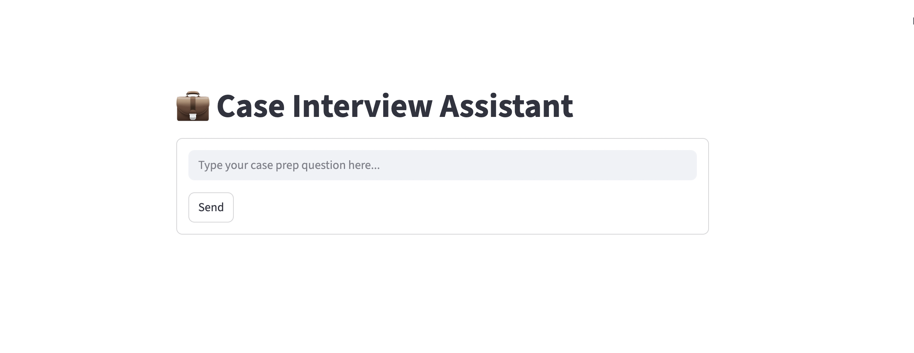
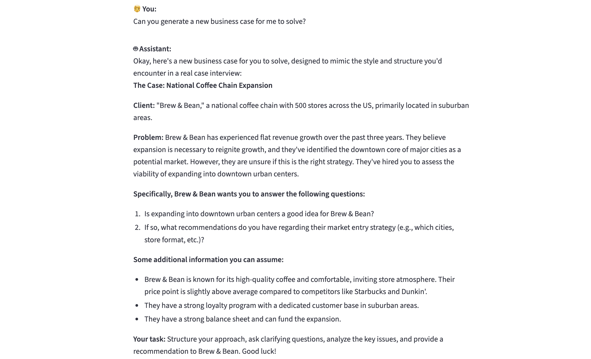
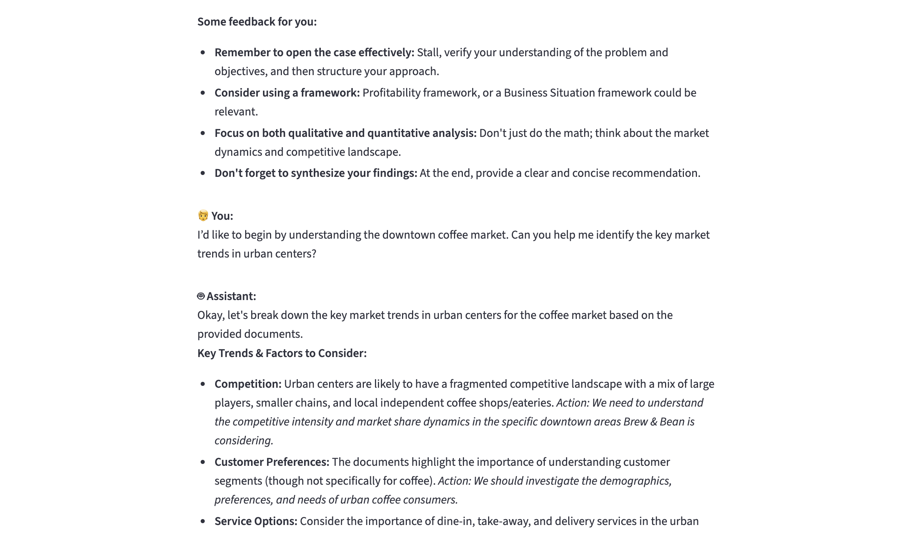
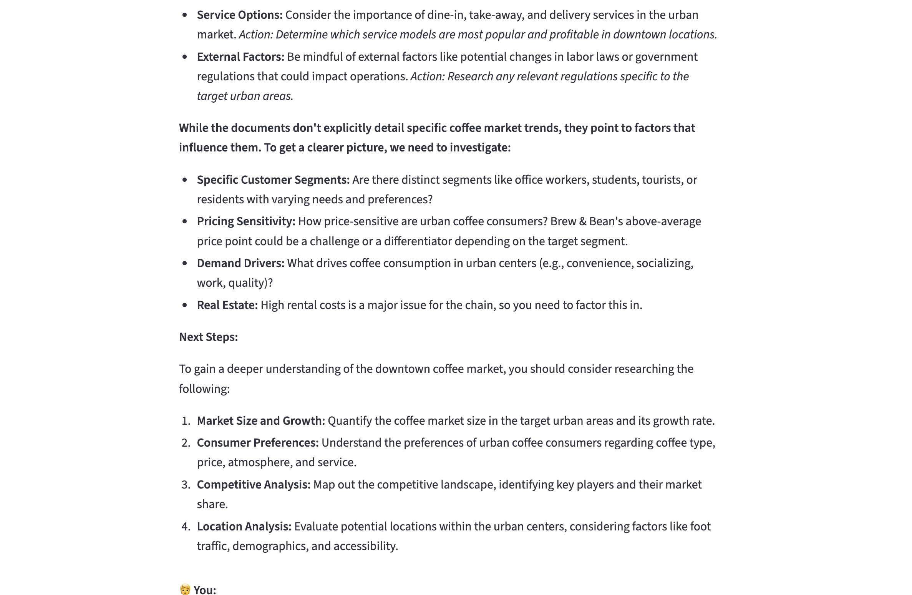
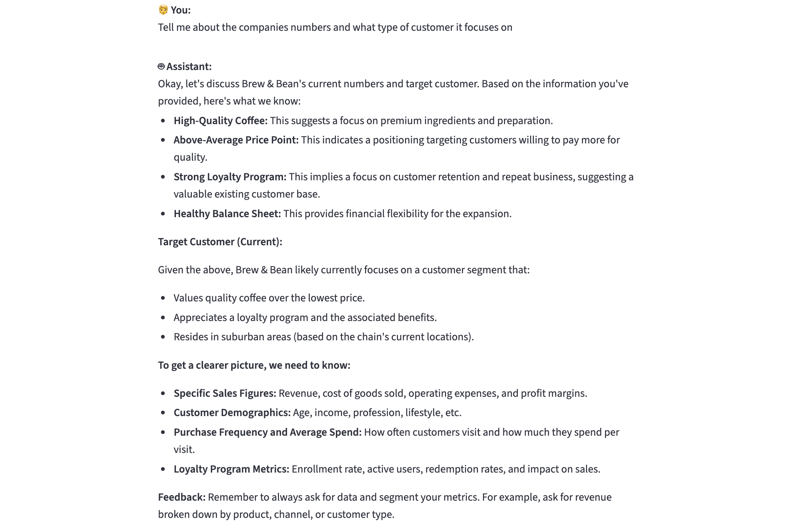

# 💼 Case Interview Assistant

An interactive AI-powered chatbot to help you prepare for consulting and case interviews. Built using LangGraph, LangChain, Qdrant (vector DB), Sentence Transformers, and Streamlit.

---

## ▶️ App Demo







---

## 📝 Features

-  Semantic Search via SentenceTransformers + Qdrant
-  Conversational Memory using summarization
-  Trained on various frameworks, guesstimates, case books
-   UI built with Streamlit


## ⚙️ Setup Instructions

Follow these steps to set up the Case Interview Assistant project locally on your machine:

### 1. Clone the Repository

```bash
git clone https://github.com/Anish-Daruka/case_preperation_chatbot.git
```

### 2. Set Up a Virtual Environment (Recommended)

```bash
python3 -m venv venv
source venv/bin/activate  # On Windows use: venv\Scripts\activate
```

### 3. Install Required Dependencies

```bash
pip install -r requirements.txt
```

### 4. Add Environment Variables

Create a `.env` file in the root directory with the following content:

```env
GOOGLE_API_KEY=your_google_genai_key_here
```

- Get your API key [here](https://makersuite.google.com/app/apikey) 

### 5. 🚀 Run Qdrant (Vector Database)

Start Qdrant locally using Docker:

#### Install Docker (if not already installed)

- **macOS:**  
    Download and install from [Docker Desktop for Mac](https://www.docker.com/products/docker-desktop/).

- **Ubuntu/Linux:**  
    ```bash
    sudo apt-get update
    sudo apt-get install -y docker.io
    sudo systemctl start docker
    sudo systemctl enable docker
    ```

- **Windows:**  
    Download and install from [Docker Desktop for Windows](https://www.docker.com/products/docker-desktop/).

```bash
docker run -p 6333:6333 qdrant/qdrant
```


### 7. 🧠 Vectorize and Upload to Qdrant

```bash
python vector_db.py
```

This script:
- Extracts and chunks text from PDFs
- Embeds them using Sentence Transformers
- Uploads them to Qdrant

### 8. 💬 Launch the Assistant

```bash
streamlit run app.py
```


---


